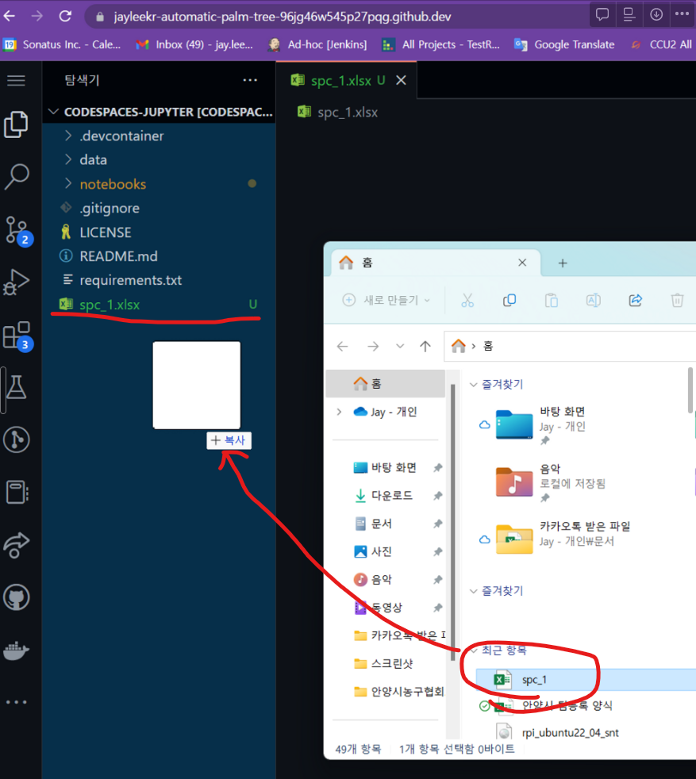
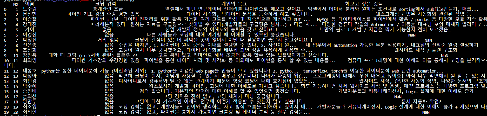
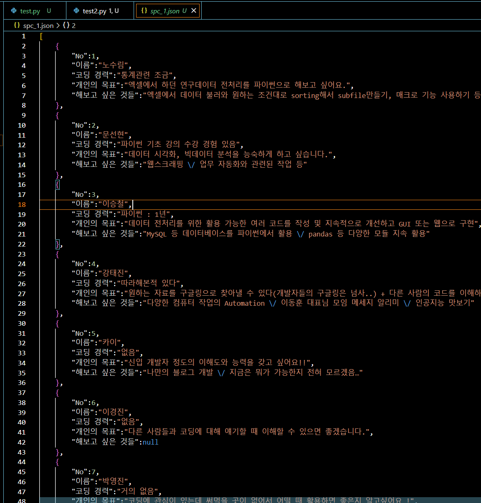

# HW-#4

## Problem

[1기 수강생](https://www.notion.so/1-d5118ab3c54f480786aad4f1fd1e8021)

CPC 1기 수강생분들은 이 강의를 수강전에 모든 정보들을 각각 적어주셨습니다.

표 형태로 되어있는 데이터 포멧에 모든 정보들을 적어 주셨던거 기억하시죠?

표형태의 포멧은 아시겠지만 Excel로 그대로 옮기기 편합니다.

실제로 Ctrl + c, Ctrl +v  만 하면 되더라고요.

[spc_1.xlsx](https://s3-us-west-2.amazonaws.com/secure.notion-static.com/59e5bd22-e523-47ec-8c16-8260bbddaeeb/spc_1.xlsx)

파일은 위와 같습니다.

### Step 1

자 위에 파일을 먼저 코드편집기의 영역으로 옮겨보고 python 코드로 이를 읽어들여 print 해봅시다!

편집기의 영역으로 파일을 옮기는 방법은 간단합니다.

그냥 Drag-and-Drop을 하면되죠! (편집기에서 지원합니다)

자 이 파일을 Pandas Library로 읽어들여서 print 해보는 것 까지가 첫번째 스탭의 결과물입니다.

### Hint

[https://pandas.pydata.org/docs/reference/api/pandas.DataFrame.to_json.html#pandas.DataFrame.to_json](https://pandas.pydata.org/docs/reference/api/pandas.DataFrame.to_json.html#pandas.DataFrame.to_json)

여기까지 잘 하셨다면 아래와 같은 출력물을 콘솔(터미널)에서 확인하실 수 있습니다.

## Step2

이제 Excel로 부터 읽어들인 이 데이터프레임(Pandas 라이브러리에서 부르는 자료구조)을 Json Format으로 바꾸고 이를 파일로 저장해봅시다.

파일이름은 마음가는대로 하시면 됩니다.

아래결과는 이쁘게 json 화 된 우리의 Excel 파일입니다.
