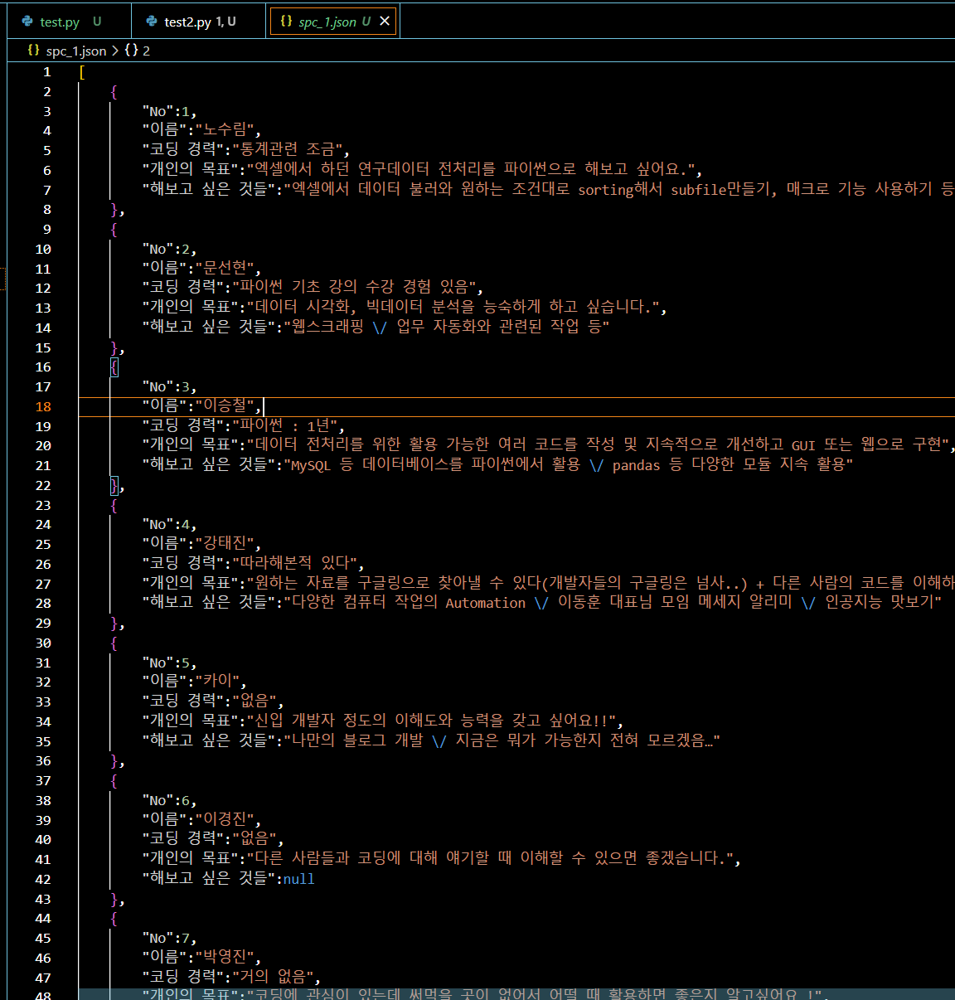

# HW-#3 Solutions

## Soltuion 1

```python
# Step 1
# Read spc_1.xlsx by using pandas
import pandas as pd

df = pd.read_excel('spc_1.xlsx', sheet_name='Sheet1')
print(df)

# Step 2
# Convert df to json and save it to file
import json

json_obj = df.to_json(orient='records', force_ascii=False, indent=4)
print(json_obj)

with open('spc_1.json', 'w') as f:
    f.write(json_obj)

```

### Result

